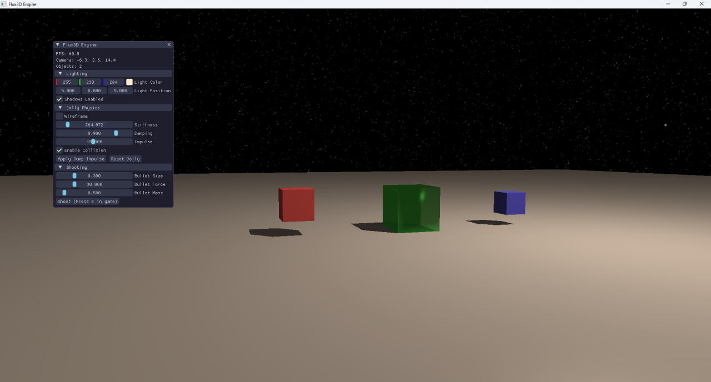

# Flux3D Engine



Flux3D is a modern three-dimensional graphics engine built on C++, integrating advanced Bullet Physics, cutting-edge rendering with shadow support, and an interactive user interface powered by ImGui.

## 🎮 Key Features

- **Realistic Physics** — Integration of Bullet Physics for accurate simulation of physical objects
- **Dynamic Shadows** — Real-time shadow rendering using shadow mapping
- **Jelly Physics** — Deformable object system based on mass points and springs
- **Fully Interactive Scene** — Shoot objects, jump, and move freely through the environment
- **Skybox Rendering** — Cubic environment mapping for immersive backgrounds
- **Catppuccin Mocha UI Theme** — Beautiful and modern control interface
- **Real-time Lighting** — Dynamic positioning and control of light sources
- **Wireframe Mode** — Debug visualization of mesh structure

## 🛠️ Technology Stack

- **C++17** — Modern C++ standard
- **OpenGL 3.3** — 3D graphics API for rendering
- **GLFW** — Window management and input handling
- **GLM** — Mathematics library for vectors and matrices
- **Bullet Physics** — 3D physics engine
- **ImGui** — Immediate mode graphical user interface
- **stb_image** — Image loading for textures

## 📋 Requirements

- **CMake 3.10** or higher
- **C++ compiler** with C++17 support
- **OpenGL 3.3** or higher
- **GLFW3**, **GLM**, **Bullet Physics** libraries

## 🚀 Installation & Compilation

### Linux / macOS

```bash
# Clone the repository
git clone https://github.com/mncrzz/Flux3D.git
cd Flux3D

# Create build directory
mkdir build
cd build

# Generate CMake project
cmake ..

# Compile
make -j$(nproc)

# Run the application
./Flux3D
